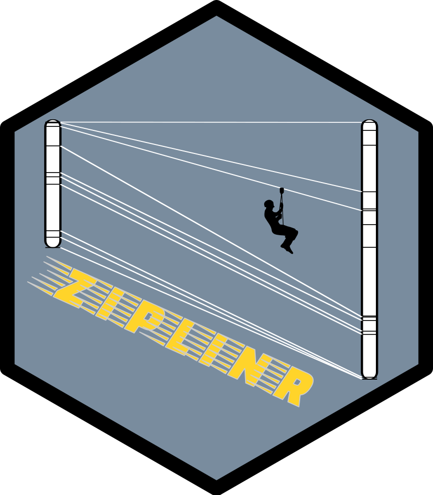

<!-- README.md is generated from README.Rmd. Please edit that file -->

```{r, include = FALSE}
knitr::opts_chunk$set(
  collapse = TRUE,
  comment = "#>",
  fig.path = "man/figures/README-",
  out.width = "100%"
)
```
# ziplinR v2.1.3 

ziplinR is a R package to project genome and genetic map positions from one map to another based on common features. It is especially useful to convert genetic positions (e.g. QTLs) from a genetic map to genomic physical positions, or to convert SNP physical coordinates into a pseudo genetic map.  

## Installation

Install devtools package if not already done

```{r, eval=FALSE}
install.packages(devtools)
```
Load devtools then install ziplinR package

```{r, eval=FALSE}
library(devtools)
install_github("jframi/ziplinR")
```
Then load ziplinR

```{r}
library(ziplinR)
```

## Usage

The package comes with 3 datasets:
  
  - p118genet : is a reference genetic map developed on a large (400 individuals) F3 population with 227 Kasp markers and used for QTL detection in the following papers : [10.1016/j.jcs.2018.11.012](https://doi.org/10.1016/j.jcs.2018.11.012) and [10.1016/j.fcr.2018.02.007](https://doi.org/10.1016/j.fcr.2018.02.007)  
- genomv2 and genomv3 : are physical positions of ~1800 Kasp markers on sorghum genome v2 and v3 assemblies.

The main function is the `ziplinR` function that projects positions from one map to the other.  
The positions to be projected need to be formatted as a `map` object from the [qtl](https://rqtl.org/) package using the `as.map` function.

Let's build a data.frame with a couple of positions from 2 chromosomes. In real life, this data.frame would be obtained from a file using `read.table` or `data.table::fread`. The names of columns doesn't matter but the order does as explained in `?as.map`
```{r}
positions <- data.frame(feat=c("mk1",
                               "qtl1-conf-int-1",
                               "qtl1-peak",
                               "qtl1-conf-int-2",
                               "mk2",
                               "qtl-feature-2"),
                        chrom=c(1,1,1,1,2,2),
                        pos=c(10, 12, 18, 24, 6, 140))
```
|feat            | chrom| pos|
|:---------------|-----:|---:|
|mk1             |     1|  10|
|qtl1-conf-int-1 |     1|  12|
|qtl1-peak       |     1|  18|
|qtl1-conf-int-2 |     1|  24|
|mk2             |     2|   6|
|qtl-feature-2   |     2| 140|
  
```{r}
m <- as.map(positions)

m
#$`1`
#            mk1 qtl1-conf-int-1       qtl1-peak qtl1-conf-int-2 
#             10              12              18              24 
#$`2`
#          mk2 qtl-feature-2 
#            6           140 
```

This map can then be projected using two reference maps :
  - map1 : a map that has the the same reference frame as the the positions you are going to project (in the case you are projecting QTL positions, it will be the genetic map that has been used for QTL detection)
- map2 : a map with a new reference frame (e.g physical map) and several (as many as possible) common markers with map1

**NB that chromosome names of map, map1 and map2 have to be same, ie "1","2",..., "10" in this example.**
  
```{r}
mp <- ziplinR(map = m, map1 = p118.genet, map2=genomv3)

mp
#$`1`
#            mk1 qtl1-conf-int-1       qtl1-peak qtl1-conf-int-2 
#        3831182         4495059         8107227        11083608 
#$`2`
#          mk2 qtl-feature-2 
#      1804105      70071134 
```

The new map with projected positions can be converted back to a data.frame with something like:
  
```{r}
data.frame(feat=unlist(lapply(mp, names)),
           chr=unlist(lapply(seq_along(mp), function(a) rep(names(mp)[a],length(mp[[a]])))),
           pos=unlist(mp))
```
|feat            |chr |      pos|
|:---------------|:---|--------:|
|mk1             |1   |  3831182|
|qtl1-conf-int-1 |1   |  4495059|
|qtl1-peak       |1   |  8107227|
|qtl1-conf-int-2 |1   | 11083608|
|mk2             |2   |  1804105|
|qtl-feature-2   |2   | 70071134|